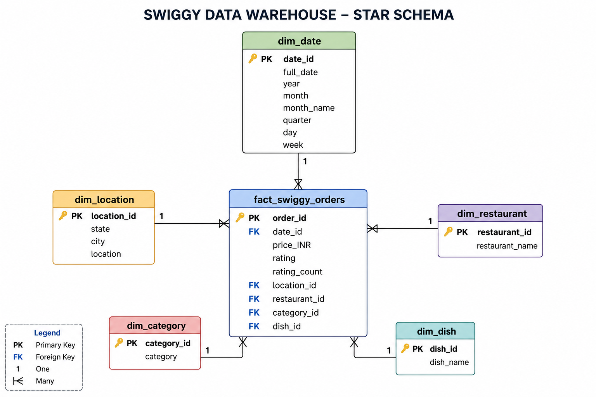

# Swiggy Data Analysis using SQL

## Project Overview

This project analyzes a Swiggy food-ordering dataset using MySQL to explore 
ordering patterns, revenue trends, restaurant performance, geographic 
performance, cuisine preferences, pricing patterns, and customer ratings.
The project follows an end-to-end SQL analytics workflow, including data
loading, data validation, data cleaning, dimensional modeling, ETL,
KPI calculation, and business analysis.

---

## Project Objectives

The main objectives of this project are to:

- Clean and validate the raw dataset before analysis.
- Design an analytics-ready star schema.
- Analyze order and revenue trends over time.
- Evaluate geographic performance across states and cities.
- Identify high-performing restaurants, categories, and dishes.
- Analyze pricing and rating distributions.
- Calculate Month-over-Month (MoM) revenue growth.
- Generate business-oriented insights using SQL.

---

## Tools & Technologies

- MySQL
- MySQL Workbench
- SQL
- GitHub

---

## Dataset

The dataset contains food-ordering records with the following attributes:

- State
- City
- Order Date
- Restaurant Name
- Location
- Category
- Dish Name
- Price (INR)
- Rating
- Rating Count

---

## Data Validation & Cleaning

Before performing the analysis, the dataset was validated and cleaned using SQL.

The process included:

- Checking for NULL values.
- Identifying blank or empty strings.
- Detecting duplicate records.
- Adding a unique identifier to each record.
- Removing duplicate records using `ROW_NUMBER()`.

---

## Data Modeling

The original flat dataset was transformed into a **Star Schema** to create
a structured analytical data model.

### Fact Table

`fact_swiggy_orders`

Measures stored in the fact table include:

- Price
- Rating
- Rating Count

### Dimension Tables

- `dim_date`
- `dim_location`
- `dim_restaurant`
- `dim_category`
- `dim_dish`

The fact table is connected to the dimension tables through primary and
foreign keys.

### Star Schema Diagram

The following diagram represents the dimensional model used for the analysis:

---

## ETL Process

The project implements a SQL-based ETL workflow:

**Extract**
- Imported the raw CSV dataset into MySQL.

**Transform**
- Validated NULL and blank values.
- Identified and removed duplicates.
- Converted text-based dates into MySQL date values.
- Created dimension tables using distinct attributes.

**Load**
- Loaded transformed data into dimension tables.
- Populated the central fact table using joins between the raw data and
  dimension tables.

---

## Key Performance Indicators (KPIs)

The following KPIs were calculated:

- Total Orders
- Total Revenue
- Average Order Value
- Average Rating

---

## Business Analysis

The analysis covers the following areas:

### Time-Based Analysis
- Monthly order trends
- Monthly revenue trends
- Month-over-Month revenue growth
- Quarterly order trends
- Quarterly revenue trends
- Orders by day of the week

### Geographic Analysis
- Top 10 cities by order volume
- State-wise revenue contribution

### Restaurant Analysis
- Top 10 restaurants by revenue
- Top 3 restaurants in each city

### Product & Category Analysis
- Top categories by order volume
- Most ordered dishes
- Category performance based on order volume and average rating

### Pricing & Rating Analysis
- Order distribution across price ranges
- Rating distribution

---

## Key Findings

- The dataset contains **197,403 orders**, generating approximately **₹53.00 million in revenue**, with an average order value of **₹268.50** and an average rating of **4.34/5**.

- Monthly order volume remained relatively stable from January to August 2025. **January recorded the highest order volume with 25,393 orders**, while February recorded the lowest with 23,292 orders.

- Revenue showed moderate month-to-month fluctuations. The largest decline occurred in **February (-8.15%)**, followed by the strongest recovery in **March (+4.86%)**.

- Orders were distributed fairly evenly throughout the week, with **Saturday recording the highest order volume (28,933)** and Tuesday the lowest (27,413).

- **Bengaluru was the leading city by order volume with 20,072 orders**, substantially ahead of other major cities in the dataset.

- **Karnataka was the largest state-level revenue contributor**, accounting for **10.29% of total revenue**.

- **KFC was the highest revenue-generating restaurant**, generating approximately **₹4.25 million**, followed by McDonald's at approximately ₹3.34 million.

- Restaurant performance varied across cities, indicating that restaurant demand and competitive position differ by geographic market.

- **Choco Lava Cake was the most frequently ordered individual dish**, followed by Veg Fried Rice and Paneer Butter Masala.

- Orders were concentrated in the **₹100–₹299 price range**, which accounted for approximately **56% of total orders**.

- Ratings were strongly concentrated at the higher end, with approximately **88% of records having ratings of 4.0 or above**.

---

## Business Recommendations

- **Strengthen high-performing geographic markets:** Bengaluru and Karnataka represent the strongest geographic market in the dataset. Maintaining restaurant availability, service quality, and targeted promotions in this market could help protect existing demand.

- **Develop city-specific restaurant strategies:** Restaurant rankings vary across cities, suggesting that promotions and restaurant partnerships should be tailored to local demand rather than using a uniform nationwide strategy.

- **Focus promotions around key price segments:** Since approximately 56% of orders fall between ₹100 and ₹299, offers, bundles, and recommendations within this range could align well with observed ordering patterns.

- **Leverage high-performing restaurant partnerships:** Major brands such as KFC and McDonald's generate substantial revenue and could be considered for targeted campaigns, bundled offers, and customer acquisition initiatives.

- **Investigate monthly revenue declines:** February and June experienced negative month-over-month revenue growth. Further analysis of restaurant availability, pricing, promotions, and seasonal factors could help identify the drivers behind these declines.

- **Use high-rated categories and products for recommendations:** Strong ratings across the dataset provide an opportunity to highlight highly rated offerings through recommendation and discovery features while continuing to monitor lower-rated segments.

- **Replicate successful market strategies selectively:** The strong performance of Bengaluru provides an opportunity to investigate which restaurant mix, pricing patterns, and product categories contribute to its performance and assess whether those practices can be adapted to other high-potential cities.

---

## SQL Concepts Demonstrated

This project demonstrates the use of:

- Aggregate Functions
- `GROUP BY`
- `HAVING`
- `CASE` Statements
- Joins
- Common Table Expressions (CTEs)
- Window Functions
- `ROW_NUMBER()`
- `LAG()`
- `PARTITION BY`
- Date Functions
- Primary Keys
- Foreign Keys
- Star Schema Modeling
- ETL and Data Transformation

---

## Repository Structure

    swiggy-sql-data-analysis/
    |
    |-- README.md
    |
    |-- dataset/
    |   |-- Swiggy_Data.csv
    |
    |-- sql/
    |   |-- 01_data_loading_cleaning.sql
    |   |-- 02_star_schema.sql
    |   |-- 03_business_analysis.sql
    |
    |-- images/
        |-- star_schema.png
